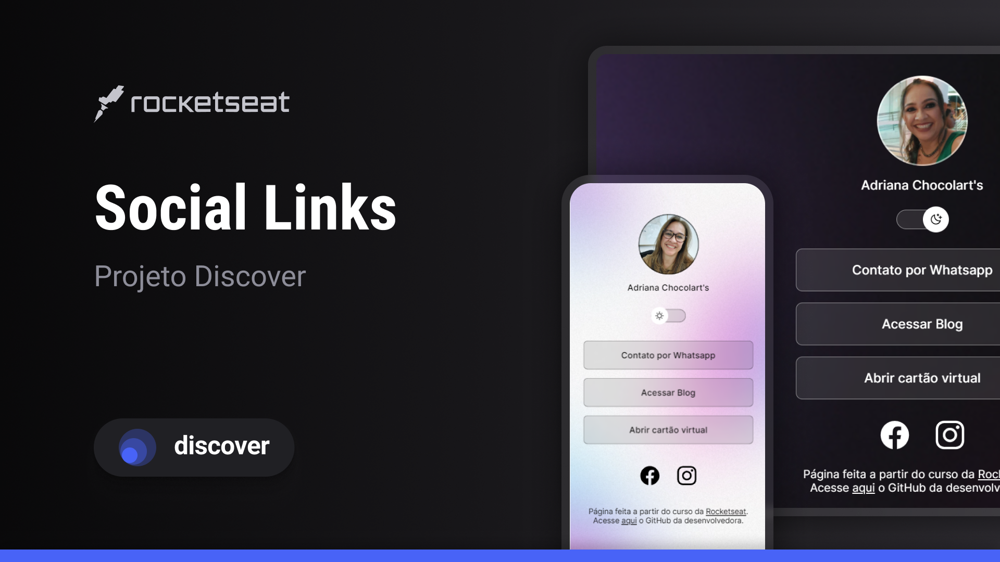

<h1 align="center"> Social links </h1>

Projeto exclusivo e gratuito, promovido pela Rocketseat para ensino de tecnologias WEB.

  <a href="#-tecnologias">Tecnologias</a>&nbsp;&nbsp;&nbsp;|&nbsp;&nbsp;&nbsp;
  <a href="#-projeto">Projeto</a>&nbsp;&nbsp;&nbsp;|&nbsp;&nbsp;&nbsp;
  <a href="#-layout">Layout</a>&nbsp;&nbsp;&nbsp;|&nbsp;&nbsp;&nbsp;
  <a href="#memo-licença">Licença</a>

  

 

  

## 🚀 Tecnologias

Esse projeto foi desenvolvido com as seguintes tecnologias:

- HTML e CSS
- JavaScript
- Git e Github
- Figma

## 💻 Projeto

Este projeto foi feito com a ajuda do curso Discover da plataforma <a href="https://app.rocketseat.com.br/discover" target="_blank"> Rocketseat </a>, servindo como um agregador para os links de redes sociais de uma doceira.

## 🔖 Layout

Você pode visualizar o layout do projeto original da plataforma através [DESSE LINK](<https://www.figma.com/file/P4JlsGcQ0DaMnOVeByAKLM/DevLinks-%E2%80%A2-Projeto-Discover-(Community)?type=design&node-id=10-620&mode=design&t=rVMSvJYDlkziaVFM-0>). É necessário ter conta no [Figma](https://figma.com) para acessá-lo.

## :memo: Licença

Esse projeto está sob a licença MIT.

---

Feito a partir do curso gratuito da Rocketseat.
